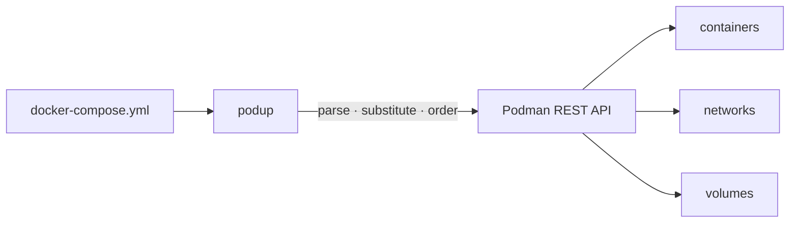

# podup

[](https://github.com/Glyndor/podup/actions/workflows/ci.yml)
[](https://github.com/Glyndor/podup/actions/workflows/release.yml)

**podup** runs your `docker-compose.yml` on rootless Podman — a single static
binary, written in Rust, with no daemon and no Python runtime.

<p align="center">
  
</p>



## ✨ Features

- 🚀 **Drop-in workflow** — `up`, `down`, `start`, `stop`, `ps`, `logs`, `exec`, `run`, `cp`, `build`, `pull`, `restart`, `rm`, `kill`, `pause`, `unpause`, `top`, `port`, `images`, `config`, `watch`
- 🔒 **Rootless by design** — drives rootless Podman over its native libpod REST API
- 📄 **Compose-spec parsing** — YAML anchors, `extends`, `include`, profiles, `env_file`, variable substitution with modifiers
- 🔁 **Dependency-aware** — `depends_on` ordering with `service_started`, `service_healthy`, and `service_completed_successfully` conditions
- 🔢 **Replicas** — `scale:` and `deploy.replicas` with named replica containers
- 🔐 **Secrets & configs** — inline content, file, environment, and `external: true` Podman-native secret sources, staged securely
- 👀 **Watch mode** — sync, rebuild or restart services on file changes per `develop.watch` rules
- ⚙️ **Systemd Quadlet export** — `generate quadlet` emits native `podman-systemd.unit` files to run your stack under systemd, no daemon
- ⌨️ **Shell completions** — `completions <shell>` for bash, zsh, fish and more (the Debian package installs them)
- 📦 **Single binary** — statically musl-linked on Linux, no runtime dependencies
- 🦀 **Library too** — embed the parser and engine in your own Rust project

## 📥 Install

Linux and macOS:

```bash
curl -fsSL https://glyndor.net/podup/install/unix | bash
```

Windows (PowerShell):

```powershell
irm https://glyndor.net/podup/install/windows | iex
```

Binaries for Linux and macOS (x86_64 and arm64) plus Windows (x86_64 and
arm64), SHA-256 verified, with build provenance attestations. On macOS and
Windows, podup talks to the `podman machine` VM through its host-side socket or
named pipe. Both installers verify the Ed25519 signature over `SHA256SUMS` (or
the GitHub build-provenance attestation) and fail closed otherwise. Or build
from source:

```bash
cargo build --release
```

### Debian / Ubuntu (apt)

On Debian and Ubuntu (amd64 and arm64), install from the Glyndor apt repository
so updates arrive through `apt upgrade`:

```bash
curl -fsSL https://glyndor.net/podup/install/unix | bash -s -- --apt
```

This installs the `glyndor-archive-keyring` package (registering the signed
repository at `https://apt.glyndor.net`) and then `podup`. Because the signing
key ships as a package, key renewals are picked up automatically by `apt
upgrade`; the apt build omits self-update, since apt owns upgrades. To set it up
by hand:

```bash
curl -fsSLO https://apt.glyndor.net/glyndor-archive-keyring.deb
sudo dpkg -i glyndor-archive-keyring.deb
sudo apt update && sudo apt install podup
```

### Updating

```bash
podup update            # download and install the latest signed release
podup update --check    # report whether a newer release exists, install nothing
```

`podup update` replaces the running binary in place, but only after verifying
the release's Ed25519 signature against the public key embedded in your build
and matching its SHA-256 checksum. It fails closed: a bad signature, missing
key, or checksum mismatch aborts before the installed binary is touched. See
[docs/self-update.md](docs/self-update.md) for the trust model. Installing into
a system directory (e.g. `/usr/local/bin`) needs elevation — re-run with `sudo`.

## 🚀 Quick start

```bash
podup up --detach                      # docker-compose.yml in the current directory
podup -f stack.yml -p myapp up -d      # explicit file and project name
podup ps                               # list project containers
podup logs api --follow                # follow one service's logs
podup down --volumes                   # tear down, removing named volumes
podup generate quadlet -o ~/.config/containers/systemd  # emit systemd Quadlet units
```

## ⚖️ vs. alternatives

|  | podup | docker-compose | podman-compose (Python) |
|---|---|---|---|
| Engine | rootless Podman | Docker daemon | Podman |
| Runtime | single static binary | Go binary + Docker daemon | Python + pip packages |
| Root required | no | typically yes (daemon) | no |
| Implementation | Rust | Go | Python |
| Podman API | native libpod REST | n/a | Podman CLI shell-out |
| Systemd Quadlet export | yes (`generate quadlet`) | no | no |
| Platforms | Linux · macOS · Windows (single binary) | Linux · macOS · Windows | wherever Python runs |
| Compose-spec depth | `extends`, profiles, `develop.watch`, inline secrets/configs | full | partial |

## 🦀 Library usage

```rust
use podup::{parse_file, podman, Engine};

#[tokio::main]
async fn main() -> podup::Result<()> {
	let file = parse_file(std::path::Path::new("docker-compose.yml"))?;
	let client = podman::connect(None)?;
	let engine = Engine::new(client, "myproject".to_string());
	engine.up(&file).await?;
	Ok(())
}
```

```toml
[dependencies]
podup = { git = "https://github.com/Glyndor/podup", tag = "v0.24.1" }
```

## 🔒 Stability & versioning

podup follows [Semantic Versioning](https://semver.org/). From **1.0.0** onward:

- The CLI surface (subcommands, flags, exit codes) and the library surface re-exported from the crate root (`parse_file`, `collect_diagnostics`, `Engine`, `ComposeError`, …) are covered by the stability guarantee. Breaking changes bump the major version and are called out in the release notes.
- Public enums and the compose/quadlet result structs are `#[non_exhaustive]`, so new variants and fields can be added in a minor release without breaking downstream code — always include a wildcard arm and avoid exhaustive struct construction.
- The libpod wire types are an internal implementation detail (not re-exported) and may change in any release.
- **MSRV: Rust 1.85.** A bump to the minimum supported Rust version is a minor-version change, never a patch.

## 📖 Docs

- [Command reference](docs/commands.md) — every subcommand, its options, and what it does
- [Migrating from Docker Compose](docs/docker-migration.md) — compatibility guide, rootless differences, deprecated fields
- [Self-update](docs/self-update.md) — the `podup update` trust model and verification flow
- [Security model](docs/security-model.md) — privilege posture, trust boundaries, SBOM and air-gap notes
- [Debian packaging](docs/debian-packaging.md) — building and distributing a `.deb`

## Contributing & security

See the org-wide [contributing guide](https://github.com/Glyndor/.github/blob/main/CONTRIBUTING.md).
Report vulnerabilities privately via the Security tab — never in a public issue.

## License

[Apache-2.0](LICENSE)
