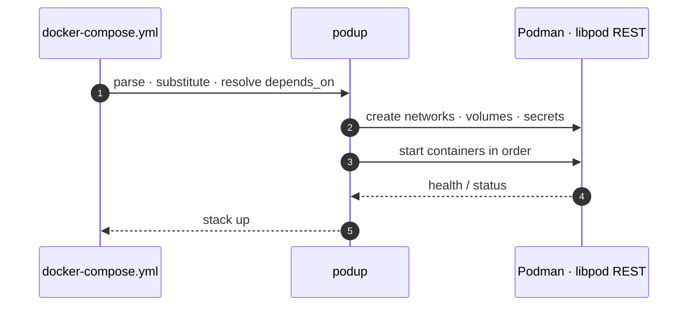

# podup

docker-compose translator and runner for rootless Podman. Reads a
docker-compose file, translates it to the native libpod REST API, and manages
the container lifecycle (`up`/`down`/`logs`/`exec`/…). A single static Rust
binary, with no daemon and no Python runtime.

[](https://github.com/Glyndor/podup/actions/workflows/ci.yml)

Package: [crates.io/crates/podup](https://crates.io/crates/podup) · MSRV 1.85 · License: MIT


## Install

### Debian / Ubuntu (apt), recommended

Register the signed Glyndor repository and install. Copy-paste:

```bash
curl -fsSL https://raw.githubusercontent.com/Glyndor/podup/main/install.sh | bash -s -- --apt
```

The installer verifies the keyring package's Ed25519 signature against its
pinned release key before anything is installed (fail-closed). The keyring
package registers `https://apt.glyndor.net` and ships the signing key, so podup
updates (and key renewals) arrive through `apt upgrade`. The apt build omits
self-update, since apt owns upgrades. Requires **Podman ≥ 5.0** (rootless).

To register the repository by hand instead, fetch the keyring and check the
key's fingerprint against the one published in the
[apt repository README](https://github.com/Glyndor/apt#verify-the-signing-key):

```bash
curl -fsSLO https://apt.glyndor.net/glyndor-archive-keyring.deb
sudo dpkg -i glyndor-archive-keyring.deb
gpg --show-keys /usr/share/keyrings/glyndor.gpg   # compare the fingerprint
sudo apt update && sudo apt install podup
```

<details>
<summary><b>Other methods: Linux/macOS script · Windows · build from source · self-update · Podman version · platforms</b></summary>

### apt, one-liner (script)

Same as above via the install script (registers the repo, then installs):

```bash
curl -fsSL https://glyndor.net/podup/install/unix | bash -s -- --apt
```

### Linux / macOS (install script)

```bash
curl -fsSL https://glyndor.net/podup/install/unix | bash
```

### Windows (PowerShell)

```powershell
irm https://glyndor.net/podup/install/windows | iex
```

Both installers verify the Ed25519 signature over `SHA256SUMS` and fail closed
otherwise.

### Build from source

```bash
cargo build --release
```

### Self-update

```bash
podup update            # download and install the latest signed release
podup update --check    # report whether a newer release exists, install nothing
```

`podup update` replaces the running binary in place only after verifying the
release's Ed25519 signature and SHA-256 checksum, failing closed otherwise. See
[docs/self-update.md](docs/self-update.md) for the trust model.

### Podman version

podup tracks the **latest stable Podman** and supports its **last two majors,
Podman 5.x and 6.x**. It talks to Podman's native libpod API (still versioned
5.x, at 5.2.0 on Podman 6), so it needs **Podman ≥ 5.0**. Both supported majors
run the integration suite in CI on every engine change (Fedora 44 for the
latest 5.x, rawhide for 6.x). Many distributions still ship 4.x, so check
`podman --version` and upgrade if needed. Fedora, Debian trixie/sid and recent
Ubuntu releases carry 5.x; on an older release, install or upgrade Podman
following the official guide: <https://podman.io/docs/installation>.

**Known limitation on Podman 6.** Copying *into* a container (`podup cp
./file web:/path`) and `watch` rules whose action includes `sync` fail with a
transport error. Copying *out* of a container works on both majors, and both
directions work on Podman 5. Fedora, Arch and Manjaro ship Podman 6 today, so
this affects them now; it is tracked in
[#1097](https://github.com/Glyndor/podup/issues/1097).

### Platforms

Linux, macOS and Windows (x86_64 and arm64). On macOS and Windows podup talks to
the `podman machine` VM through its host-side `unix://` socket or `npipe://`
named pipe; the socket must be local (remote `tcp://`/`ssh://` are rejected).

</details>

## Quick start

```bash
podup up -d      # start the stack in the current directory
podup ps         # see what's running
podup down -v    # tear down and remove volumes
```

Full command reference: [docs/commands.md](docs/commands.md).

## Design

Rootless-native libpod API, real compose-spec support (`extends`, profiles,
`develop.watch`, inline secrets), and systemd Quadlet export. The Rust library
crate is consumed by [helmly-agent](https://github.com/Glyndor/helmly-agent);
API docs at [docs.rs/podup](https://docs.rs/podup).



## Benchmarks

Peak memory and per-operation latency measured against docker-compose and
podman-compose, same Podman instance, same digest-pinned images, median of 10
runs.


Full tables and methodology: [docs/benchmarks.md](docs/benchmarks.md).

## Documentation

- [Commands](docs/commands.md)
- [Migrating from Compose](docs/docker-migration.md)
- [Benchmarks](docs/benchmarks.md)
- [Self-update](docs/self-update.md)
- [Security model](docs/security-model.md)

## License

[MIT](LICENSE). Report vulnerabilities privately via the **Security** tab, never in a public issue.
