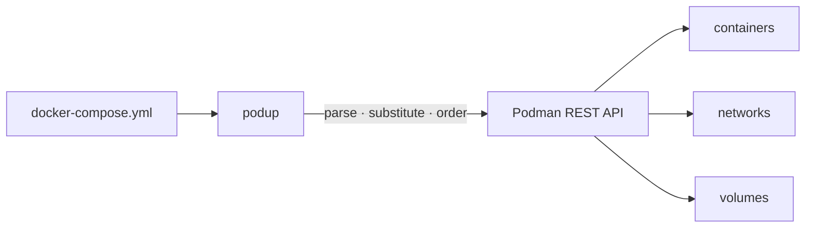

# podup

[](https://github.com/Glyndor/podup/actions/workflows/ci.yml)
[](https://github.com/Glyndor/podup/actions/workflows/release.yml)

**podup** runs your `docker-compose.yml` on rootless Podman — a single static
binary, written in Rust, with no daemon and no Python runtime.



## ✨ Features

- 🚀 **Drop-in workflow** — `up`, `down`, `start`, `stop`, `ps`, `logs`, `exec`, `run`, `cp`, `build`, `pull`, `restart`, `rm`, `kill`, `pause`, `unpause`, `top`, `port`, `images`, `config`, `watch`
- 🔒 **Rootless by design** — drives rootless Podman over its Docker-compatible API
- 📄 **Compose-spec parsing** — YAML anchors, `extends`, `include`, profiles, `env_file`, variable substitution with modifiers
- 🔁 **Dependency-aware** — `depends_on` ordering with `service_started`, `service_healthy`, and `service_completed_successfully` conditions
- 🔢 **Replicas** — `scale:` and `deploy.replicas` with named replica containers
- 🔐 **Secrets & configs** — inline content, file, and environment sources staged securely
- 👀 **Watch mode** — sync, rebuild or restart services on file changes per `develop.watch` rules
- 📦 **Single binary** — statically musl-linked on Linux, no runtime dependencies
- 🦀 **Library too** — embed the parser and engine in your own Rust project

## 📥 Install

```bash
curl -fsSL https://glyndor.net/install/podup | bash
```

Binaries for Linux and macOS (x86_64 and arm64) plus Windows (x86_64),
SHA-256 verified, with build provenance attestations. On macOS and Windows,
podup talks to the `podman machine` VM through its host-side socket or named
pipe. Windows users download `podup-windows-x86_64.exe` from the
[releases page](https://github.com/Glyndor/podup/releases) directly. Or build
from source:

```bash
cargo build --release
```

## 🚀 Quick start

```bash
podup up --detach                      # docker-compose.yml in the current directory
podup -f stack.yml -p myapp up -d      # explicit file and project name
podup ps                               # list project containers
podup logs api --follow                # follow one service's logs
podup down --volumes                   # tear down, removing named volumes
```

## ⚖️ vs. alternatives

|  | podup | docker-compose | podman-compose (Python) |
|---|---|---|---|
| Engine | rootless Podman | Docker daemon | Podman |
| Runtime | single static binary | Go binary + Docker daemon | Python + pip packages |
| Root required | no | typically yes (daemon) | no |
| Implementation | Rust | Go | Python |

## 🦀 Library usage

```rust
use podup::{parse_file, podman, Engine};

#[tokio::main]
async fn main() -> podup::Result<()> {
	let file = parse_file(std::path::Path::new("docker-compose.yml"))?;
	let docker = podman::connect(None)?;
	let engine = Engine::new(docker, "myproject".to_string());
	engine.up(&file).await?;
	Ok(())
}
```

```toml
[dependencies]
podup = { git = "https://github.com/Glyndor/podup", tag = "v0.5.5" }
```

## Contributing & security

See the org-wide [contributing guide](https://github.com/Glyndor/.github/blob/main/CONTRIBUTING.md).
Report vulnerabilities privately via the Security tab — never in a public issue.

## License

[Apache-2.0](LICENSE)
