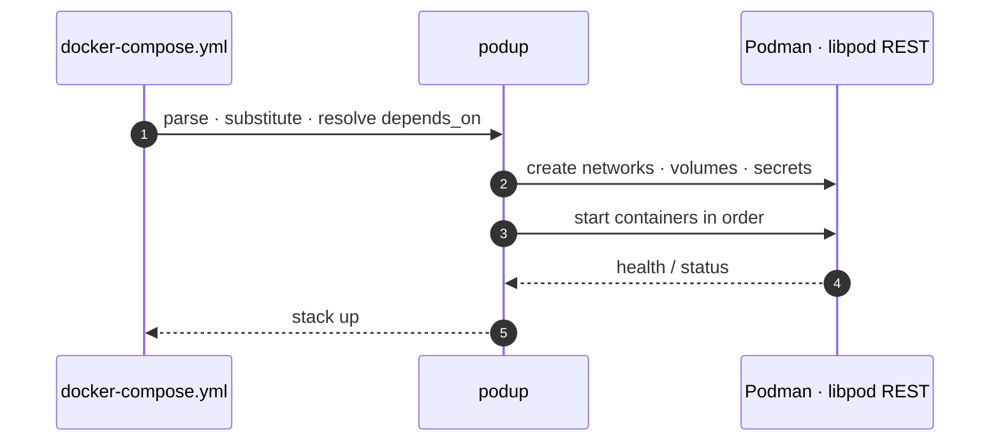

<div align="center">

# podup

**docker-compose on rootless Podman — one static Rust binary. No daemon. No Python.**


[](https://github.com/Glyndor/podup/actions/workflows/ci.yml)
[](https://crates.io/crates/podup)
[](https://crates.io/crates/podup)
[](Cargo.toml)
[](LICENSE)

[**Website**](https://glyndor.net/projects/podup) · [**Install**](#-install) · [**Quick start**](#-quick-start) · [**Benchmarks**](docs/benchmarks.md) · [**Docs**](docs/)


</div>

---

## 📥 Install

```bash
curl -fsSL https://glyndor.net/podup/install/unix | bash      # Linux / macOS
```

```powershell
irm https://glyndor.net/podup/install/windows | iex           # Windows
```

Signed, SHA-256 verified, fail-closed. Requires **Podman ≥ 5.0** (rootless) — check with `podman --version`. podup tracks the latest stable Podman — validated on **5.x** and **6.0.0**.

<details>
<summary><b>Podman version · apt · build from source · self-update · platforms</b></summary>

### Podman version

podup tracks the **latest stable Podman** and supports the **last two majors**.
It talks to Podman's native libpod API (still versioned 5.x — 5.2.0 on Podman 6),
so it needs **Podman ≥ 5.0**. Today podup is validated on **Podman 5.x**;
**Podman 6 support is landing next**. Many distributions still ship 4.x — check
`podman --version` and upgrade if needed. Fedora, Debian trixie/sid and recent
Ubuntu releases carry 5.x; on an older release, install or upgrade Podman
following the official guide: <https://podman.io/docs/installation>.

### Debian / Ubuntu (apt)

Install from the Glyndor apt repository so updates arrive through `apt upgrade`:

```bash
curl -fsSL https://glyndor.net/podup/install/unix | bash -s -- --apt
```

This installs the `glyndor-archive-keyring` package (registering the signed
repository at `https://apt.glyndor.net`) and then `podup`. Key renewals are
picked up automatically by `apt upgrade`; the apt build omits self-update, since
apt owns upgrades. By hand:

```bash
curl -fsSLO https://apt.glyndor.net/glyndor-archive-keyring.deb
sudo dpkg -i glyndor-archive-keyring.deb
sudo apt update && sudo apt install podup
```

### Build from source

```bash
cargo build --release
```

### Self-update

```bash
podup update            # download and install the latest signed release
podup update --check    # report whether a newer release exists, install nothing
```

`podup update` replaces the running binary in place only after verifying the
release's Ed25519 signature and SHA-256 checksum — it fails closed otherwise. See
[docs/self-update.md](docs/self-update.md) for the trust model.

### Platforms

Linux, macOS and Windows (x86_64 and arm64). On macOS and Windows podup talks to
the `podman machine` VM through its host-side `unix://` socket or `npipe://`
named pipe; the socket must be local (remote `tcp://`/`ssh://` are rejected).

</details>

## 🚀 Quick start

```bash
podup up -d      # start the stack in the current directory
podup ps         # see what's running
podup down -v    # tear down and remove volumes
```

[Every command →](docs/commands.md)

## ⚡ Why

Rootless-native libpod API, real compose-spec (`extends`, profiles,
`develop.watch`, inline secrets), and systemd Quadlet export —
[vs alternatives](docs/benchmarks.md#vs-alternatives) · [Rust library](https://docs.rs/podup).



## 📊 Benchmarks

<div align="center">

### ~7 MiB flat memory &nbsp;•&nbsp; near-zero CPU &nbsp;•&nbsp; up to 14× faster than podman-compose



</div>

Same Podman, same digest-pinned images, median of 10 runs. [Full tables & methodology →](docs/benchmarks.md)

## 📖 Docs

[Commands](docs/commands.md) · [Migrating from Compose](docs/docker-migration.md) · [Benchmarks](docs/benchmarks.md) · [Self-update](docs/self-update.md) · [Security model](docs/security-model.md)

## License

[Apache-2.0](LICENSE) — report vulnerabilities privately via the **Security** tab, never in a public issue.
