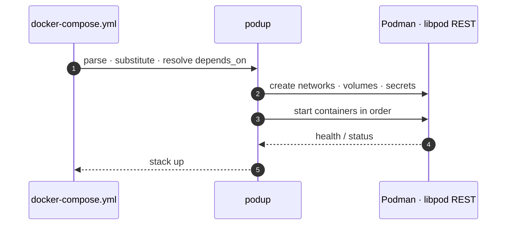

# podup

docker-compose translator and runner for rootless Podman. Reads a
docker-compose file, translates it to the native libpod REST API, and manages
the container lifecycle (`up`/`down`/`logs`/`exec`/…). A single static Rust
binary, with no daemon and no Python runtime.

[](https://github.com/Glyndor/podup/actions/workflows/ci.yml)

MSRV 1.85 · License: MIT


## Install

On Debian 12 or Ubuntu 24.04, read [Podman version](#podman-version) first:
both ship Podman 4.x, below the floor podup needs, and the line below refuses
to install there rather than leaving a podup that cannot reach an engine.

```sh
curl -fsSL https://apt.glyndor.net/install/podup | sudo sh
```

That is the whole install on Debian and Ubuntu. It registers the signed Glyndor
apt repository, verifies the archive key's fingerprint before trusting it, and
installs podup with apt, so upgrades and signing-key renewals arrive through
`apt upgrade` like any other package. Root is needed because it installs
packages. It leaves nothing of its own behind: the download is removed, and so
is anything it had to install just to check the key.

podup needs **Podman ≥ 5.0** (rootless). The package depends on it, so apt
installs it alongside podup, and refuses the install on a distribution whose
Podman is older than that. It also depends on `unattended-upgrades`, because an
apt-installed podup updates through apt and nothing else: `podup update` refuses
to replace a dpkg-owned binary, and only the latest release is supported. And on
`glyndor-archive-keyring`, which is what points that engine at Glyndor rather
than only at Debian's own security suite: it ships the `.sources` file and the
`Allowed-Origins` entry, and the entry is appended to whatever the machine
already allows rather than replacing it.

That dependency guarantees `unattended-upgrades` is installed, not that it is
running. What switches it on is `/etc/apt/apt.conf.d/20auto-upgrades`, which is
system-wide policy for every package on the machine rather than podup's to set,
so no podup maintainer script writes it. The one-line installer above writes it
when it is absent, and Ubuntu normally has it already. If you registered the
archive yourself and then ran `apt install podup` on Debian, podup and the
allowlist are both installed but nothing upgrades it until you run `apt upgrade`. `systemctl status unattended-upgrades` says which of the two you
have.

Podman is daemonless, but podup speaks the libpod API, so the
socket still has to be listening:

```sh
systemctl --user enable --now podman.socket
```

### Optional: macOS

```sh
brew install glyndor/tap/podup
```

### Optional: Windows

```powershell
scoop bucket add glyndor https://github.com/Glyndor/scoop-bucket
scoop install podup
```

Scoop clones the bucket with git, so git has to be installed first; Scoop's own
installer does not bring it.

`podup-windows-$ARCH.exe` ships without an Authenticode signature, and a
fresh release asset has no SmartScreen reputation either. A Windows host with
Smart App Control enabled refuses to launch the binary; that is the report in
[#1774](https://github.com/Glyndor/podup/issues/1774). What SmartScreen alone
does with the binary has not been measured. The Ed25519 signature over
`SHA256SUMS` and the SHA-256 checksum that `install.ps1` verifies are
unrelated to either: those prove the bytes came from this repository, while
Smart App Control reads the Authenticode signature embedded in the PE, which
is absent.

The path that works on Windows today is the WSL route below. Run the Linux
build inside the `podman-machine-default` WSL distro next to the engine
Podman ships; install it with the script under
[Optional: Linux without apt](#optional-linux-without-apt). That distro is
Fedora-based, so the apt line at the top of this README does not apply.

If podup runs inside the `podman-machine-default` WSL distro instead, as the
Linux build next to the engine, Podman there needs one setting before a build
works. Measured on 2026-09-10 in that distro: every `RUN` step of a build
failed under crun until Podman's cgroup manager was changed from `systemd`,
its default, to `cgroupfs`. The distro had no user systemd session, so the
`systemd` manager had nothing to talk to. Neither the runtime's error text nor
the Podman and WSL versions were recorded, so the symptom to go by is a `RUN`
step that dies without a stated reason. See [#1778](https://github.com/Glyndor/podup/issues/1778)
for the original report. The setting goes inside the distro, in the
`containers.conf` of the user that runs Podman:

```toml
# ~/.config/containers/containers.conf
[engine]
cgroup_manager = "cgroupfs"
```

If that file already has an `[engine]` table, add the key to it rather than
opening a second one. To check that it took effect, ask the API service podup
talks to:

```sh
podman --remote info --format '{{.Host.CgroupManager}}'
```

It prints `cgroupfs` once the setting is in use. If it still prints `systemd`,
the service was started before the file changed and has to be restarted. On an
ordinary Linux host `systemd` is the correct value and none of this applies.

Smart App Control offers no per-binary override, so there is nothing to tick
that lets this `.exe` through while it stays on. The route above is the one
that works. This is the state on 2026-09-22 and it holds until a signature
ships; it carries no promised date.

### Optional: Linux without apt

```sh
curl -fsSL https://glyndor.net/podup/install/unix | bash
```

Installs the release binary rather than a package. Use it on a distribution apt
does not serve; on Debian and Ubuntu the line at the top is better, because apt
keeps podup current and this does not.

<details>
<summary><b>Build from source · self-update · Podman versions · platforms</b></summary>

### Build from source

```sh
cargo build --release
```

### Self-update

Only for installs that did not come from a package manager. The apt build omits
the subcommand entirely, and an apt, Homebrew or Scoop install is refused before
anything is downloaded and pointed at that manager's own upgrade command.

```sh
podup update            # download and install the latest signed release
podup update --check    # report whether a newer release exists, install nothing
```

`podup update` replaces the running binary in place only after verifying the
release's Ed25519 signature and SHA-256 checksum, failing closed otherwise. See
[docs/self-update.md](docs/self-update.md) for the trust model.

### Podman version

podup tracks the **latest stable Podman** and supports its **last two majors,
Podman 5.x and 6.x**. It talks to Podman's native libpod API, requesting the
`/v5.0.0/libpod` path that Podman 6 still serves; the gate is the major version
the engine reports, so it needs **Podman ≥ 5.0**. When a new major ships, it is
added and the oldest is dropped, but only once the **newest LTS of each
distribution family carries the new one or better**, so nobody on a current
release is stranded. Both supported majors run the
integration suite in CI on every engine change (Fedora 44 for the latest 5.x,
rawhide for 6.x). Many distributions still ship 4.x, so `podman --version` is
worth checking before installing, and a distribution never changes its Podman
major version mid-release, so an LTS that shipped below the floor stays below
it for its whole supported life.

Podman versions as each distribution's package index listed them on 2026-08-24,
the Ubuntu rows re-read on 2026-09-05; a point release can move them.

| distribution                  | Podman | podup runs |
|-------------------------------|--------|------------|
| Debian 12 bookworm            | 4.3.1  | no         |
| Debian 13 trixie              | 5.4.2  | yes        |
| Ubuntu 22.04 LTS              | 3.4.4  | no         |
| Ubuntu 24.04 LTS              | 4.9.3  | no         |
| Ubuntu 26.04 LTS              | 5.7.0  | yes        |
| Fedora 42 and newer           | 5.x+   | yes        |

Ubuntu 24.04 LTS is not supported: it ships Podman 4.9.3 and will keep shipping
that for its whole supported life. On any row marked "no", `apt install podup`
refuses rather than installing a podup that cannot reach an engine, and the
engine has to come from somewhere other than the distribution:
<https://podman.io/docs/installation>.

Driving a **remote** Podman, or a `podman machine`, is the case apt cannot
express: a package relationship only sees the local machine. Use the release
binary there. `install.sh` warns instead of refusing when no local Podman is
present, and takes `--skip-podman-check` when a local one is present but is not
the engine podup will use.

### Platforms

Linux, macOS and Windows (x86_64 and arm64). On macOS and Windows podup talks to
the `podman machine` VM through its host-side `unix://` socket or `npipe://`
named pipe; the socket must be local (remote `tcp://`/`ssh://` are rejected).

</details>

## Quick start

```bash
podup up -d      # start the stack in the current directory
podup ps         # see what's running
podup down       # stop and remove containers and networks; volumes are kept
```

`podup down -v` also removes the project's named volumes and the data in them; see [`down` in the command reference](docs/commands.md#down).

Full command reference: [docs/commands.md](docs/commands.md).

## Design

Rootless-native libpod API, real compose-spec support (`extends`, profiles,
`develop.watch`, inline secrets), and systemd Quadlet export. There is a library
target, and the integration tests are built against it, but podup is distributed
as a binary: it is not published to crates.io and carries no semver promise about
its Rust API.


```mermaid
sequenceDiagram
    autonumber
    participant Y as docker-compose.yml
    participant P as podup
    participant L as Podman · libpod REST
    Y->>P: parse · substitute · resolve depends_on
    P->>L: create networks · volumes · secrets
    P->>L: start containers in order
    L-->>P: health / status
    P-->>Y: stack up
```

## Benchmarks

Peak memory and per-operation latency against docker-compose and podman-compose,
**all three driving the same rootless Podman**, same digest-pinned images,
median of 10 measured runs (12 iterations, 2 warm-up discarded), on podup 5.7.1.
podup is fastest in all 29 measured rows, though three teardown rows
(`deep-chain`, `many-services` and `multi-healthcheck`) win by less than their
own standard deviation and should be read as ties; the widest gaps are the ones
with many services.

| | podup | docker-compose | podman-compose |
|---|---|---|---|
| memory per command | **5.7 MiB** | 29.0 MiB | 45.9 MiB |
| `up`, 42 services | **1.11 s** | 1.58 s | 6.65 s |
| `up`, 12 services | **0.37 s** | 0.47 s | 1.89 s |
| `config` (parse only) | **13.0 ms** | 38.3 ms | 112.7 ms |



Full tables and methodology: [docs/benchmarks.md](docs/benchmarks.md).

## Documentation

- [Commands](docs/commands.md)
- [Migrating from Compose](docs/docker-migration.md)
- [Autostart at boot](docs/autostart.md)
- [Benchmarks](docs/benchmarks.md)
- [Self-update](docs/self-update.md)
- [Security model](docs/security-model.md)
- [Threat model](docs/threat-model.md)
- [Debian packaging](docs/debian-packaging.md)

## License

[MIT](LICENSE). Report vulnerabilities privately via the **Security** tab, never in a public issue.
