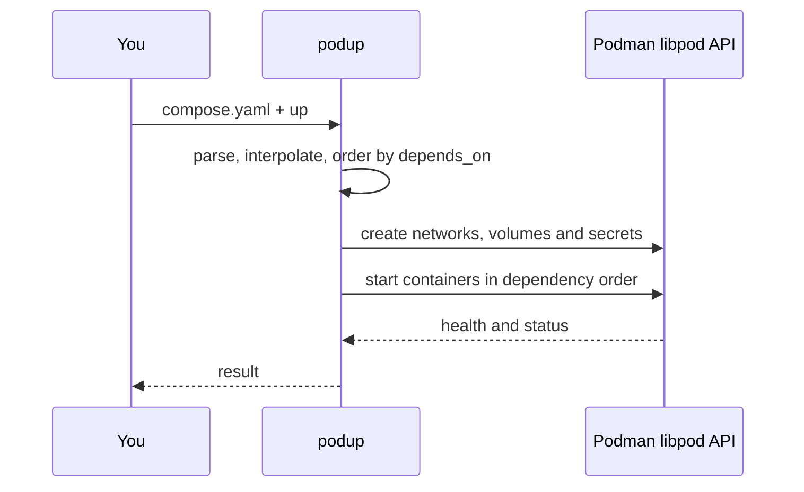
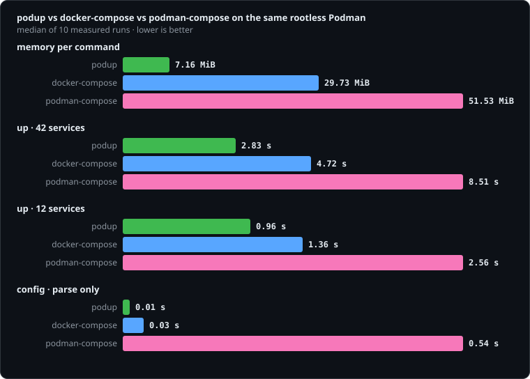

# podup

Run Compose projects on rootless Podman. podup reads your `compose.yaml` and
drives Podman through its native libpod API: one standalone binary, no daemon
of its own, no Python.

[](https://github.com/Glyndor/podup/actions/workflows/ci.yml)


## Features

- 🔁 **The Compose commands you know**, with `depends_on` ordering and healthcheck conditions.
- 🧩 **`extends`, profiles, `include` and `develop.watch`** file sync.
- 🔐 **Podman-native secrets and configs**, including inline `content:`.
- ⚙️ **systemd integration**: export a project as Quadlet units, or start it at boot with `podup autostart`.
- 🛡️ **`podup audit`** flags risky settings in a Compose file before you run it.

## Install

podup needs **Podman 5.0 or newer**, reached through a local socket, and runs
on Linux, macOS and Windows (x86_64 and arm64). Debian 12 and Ubuntu 24.04 ship
an older Podman; see [Platforms](docs/docker-migration.md#platforms).

```sh
curl -fsSL https://apt.glyndor.net/install/podup | sudo sh
```

On Debian and Ubuntu this adds the signed Glyndor apt repository and installs
podup as a package, so `apt upgrade` keeps it current.

<details>
<summary><b>Optional: macOS, Windows and other Linux distributions</b></summary>

**macOS** (with a running `podman machine`):

```sh
brew install glyndor/tap/podup
```

**Windows** (with a running `podman machine`; Scoop needs git):

```powershell
scoop bucket add glyndor https://github.com/Glyndor/scoop-bucket
scoop install podup
```

The Windows binary is not Authenticode-signed yet; with Smart App Control
enabled it was reported blocked on 2026-09-22
([#1774](https://github.com/Glyndor/podup/issues/1774)). The Platforms section
above describes the WSL route.

**Other Linux distributions** (needs `curl`, `sha256sum`, Python 3 with
`cryptography` to verify the download, and write access or `sudo` for
`/usr/local/bin`):

```sh
curl -fsSL https://glyndor.net/podup/install/unix | bash
```

This installs the release binary to `/usr/local/bin`; `podup update` keeps it
current.

</details>

## Quick start

On Linux with a systemd user session, enable the rootless Podman API socket once:

```sh
systemctl --user enable --now podman.socket
```

Then, in a directory with a Compose file:

```sh
podup up -d      # start the stack
podup ps         # list its containers
podup down       # remove containers and networks; volumes are kept
```

`podup down -v` also removes the project's named volumes and their data.

## What `podup up` does


```mermaid
sequenceDiagram
    participant U as You
    participant P as podup
    participant L as Podman libpod API
    U->>P: compose.yaml + up
    P->>P: parse, interpolate, order by depends_on
    P->>L: create networks, volumes and secrets
    P->>L: start containers in dependency order
    L-->>P: health and status
    P-->>U: result
```

Compose files are trusted input: review their host mounts and commands before
running them.

## Performance

Client memory and latency against docker-compose and podman-compose on the
same rootless Podman (podup 5.10.8, median of 10 measured runs):



[Benchmarks](docs/benchmarks.md) has the method, all results and limitations.

## Documentation

| Guide | What it covers |
|---|---|
| [Commands](docs/commands.md) | Commands, options and environment settings |
| [Migrating from Compose](docs/docker-migration.md) | Supported fields, differences, platforms |
| [Autostart](docs/autostart.md) | Starting a project at boot, Quadlet export |
| [Security model](docs/security-model.md) and [threat model](docs/threat-model.md) | What podup protects and what it assumes |
| [Self-update](docs/self-update.md) | How `podup update` verifies a release |
| [Debian packaging](docs/debian-packaging.md) | The apt package and its update policy |
| [Contributing](CONTRIBUTING.md) | Building from source and the contribution flow |

## License

[MIT](LICENSE). Report vulnerabilities privately through the **Security** tab,
never in a public issue.
